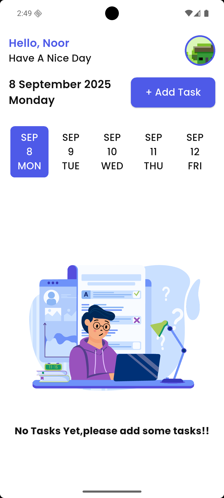
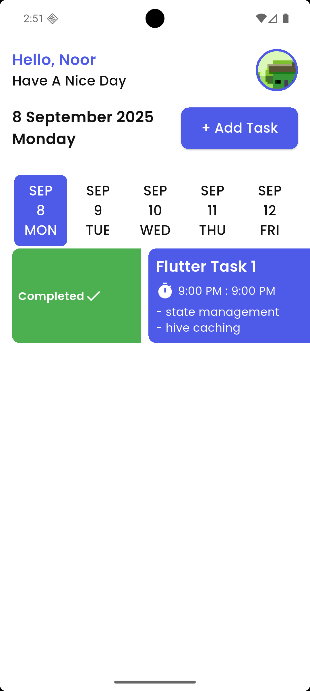

# 📝 Taskati - Task Management App


**Taskati** 
is a modern and intuitive task management application built with Flutter. The name "Taskati" means "My Tasks" in Arabic, reflecting the app's focus on personal productivity and task organization.

## 🌟 Features

### Core Functionality
- ✅ **Create, Edit & Delete Tasks** - Full CRUD operations for task management
- 📅 **Date & Time Scheduling** - Set due dates and reminders for tasks
- 🏷️ **Task Categories** - Organize tasks with custom categories and tags
- ⭐ **Priority Levels** - Mark tasks with different priority levels (High, Medium, Low)
- ✔️ **Task Completion** - Mark tasks as completed with progress tracking
- 🔍 **Search & Filter** - Quickly find tasks with search and filter options

### User Experience
- 🎨 **Modern UI/UX** - Clean, intuitive interface following Material Design principles
- 🌙 **Dark/Light Mode** - Toggle between dark and light themes
- 📱 **Responsive Design** - Optimized for different screen sizes
- 🔄 **Real-time Updates** - Instant updates across the application
- 💾 **Local Storage** - Data persistence using local storage solutions

### Additional Features
- 📊 **Progress Tracking** - Visual progress indicators and statistics
- 🔔 **Notifications** - Task reminders and due date notifications
- 📈 **Analytics** - Task completion statistics and productivity insights
- 🎯 **Goal Setting** - Set and track personal productivity goals
- 🗂️ **Task Organization** - Drag and drop functionality for task reordering


### 📱 App Screenshots

---

## 🌙 Dark Mode

## 🌙 Dark Mode

---

#### 🏠 Main Screens
<div align="center">
  
  &nbsp;&nbsp;&nbsp;
  
</div>

---

#### 🚀 Splash
<div align="center">
  
</div>

---

#### 📝 Task Screens
<div align="center">
  
</div>

---

#### 📅 Pickers
<div align="center">
  
  &nbsp;&nbsp;&nbsp;
  
</div>

---

#### 👤 Profile
<div align="center">
  
</div>

---

## ☀️ Light Mode

---

#### 🏠 Main Screens
<div align="center">
  
  &nbsp;&nbsp;&nbsp;
  
</div>

---

#### 🚀 Splash
<div align="center">
  
</div>

---

#### 📝 Task Screens
<div align="center">
  
  &nbsp;&nbsp;&nbsp;
  
  &nbsp;&nbsp;&nbsp;
  
</div>

---

#### 📅 Pickers
<div align="center">
  
  &nbsp;&nbsp;&nbsp;
  
</div>

---

#### 👤 Profile
<div align="center">
  
</div>


  

  


## 🏗️ Architecture

The app follows a clean architecture pattern with the following structure:

```
lib/
├── core/
│   ├── constants/
│   ├── themes/
│   ├── utils/
│   └── widgets/
├── data/
│   ├── models/
│   ├── repositories/
│   └── services/
├── presentation/
│   ├── screens/
│   ├── widgets/
│   └── providers/
└── main.dart
```

### Key Components
- **Models** - Data structures for tasks, categories, and user preferences
- **Services** - Local storage, notifications, and external API integrations
- **Providers** - State management using Provider or Riverpod
- **Repositories** - Data access layer abstracting storage operations
- **Widgets** - Reusable UI components and custom widgets

## 🚀 Getting Started

### Prerequisites
- Flutter SDK (>=3.0.0)
- Dart SDK (>=2.17.0)
- Android Studio / VS Code
- iOS Simulator / Android Emulator

### Installation

1. **Clone the repository**
   ```bash
   git clone https://github.com/NooR-El-Deen-Ramadan/taskati.git
   cd taskati
   ```

2. **Install dependencies**
   ```bash
   flutter pub get
   ```

3. **Run the app**
   ```bash
   flutter run
   ```

### Build for Production

**Android**
```bash
flutter build apk --release
```

**iOS**
```bash
flutter build ios --release
```

### Additional Packages
- **UI/UX**: `flutter_animate`, `lottie`, `cached_network_image`
- **Storage**: `hive`, `path_provider`
- **Notifications**: `flutter_local_notifications`
- **Date/Time**: `table_calendar`, `flutter_datetime_picker`
- **Navigation**: `go_router` or `auto_route`

## 🧪 Testing

Run tests with:
```bash
flutter test
```

### Test Coverage
- Unit Tests: Core business logic
- Widget Tests: UI components
- Integration Tests: End-to-end user flows

## 📄 License

This project is licensed under the MIT License - see the [LICENSE](LICENSE) file for details.

## 👨‍💻 Author

**Nour El-Deen Ramadan**
- GitHub: [@NooR-El-Deen-Ramadan](https://github.com/NooR-El-Deen-Ramadan)
- Email: [@nooraldeinrmadan@gamil.com]

## 🔄 Version History

- **v1.0.0** - Initial release with core task management features
- **v1.1.0** - Added categories and priority levels
- **v1.2.0** - Implemented dark mode and notifications
- **v1.3.0** - Added search and filter functionality


